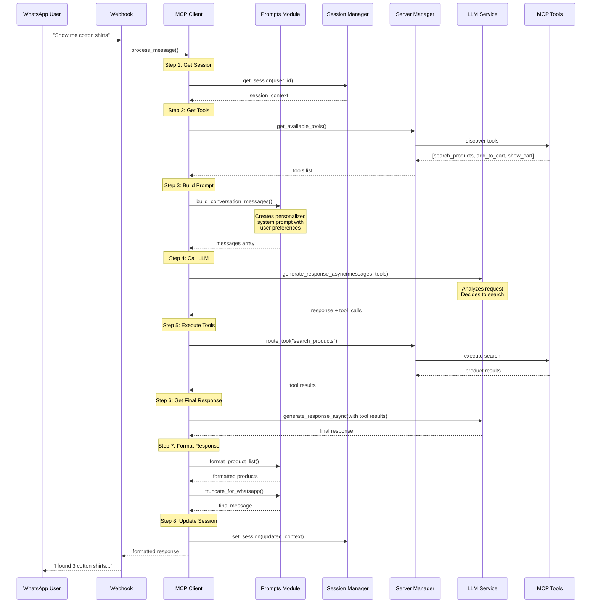

# MCP Client Flow Diagram

## How the MCP Client Works with Prompts

### Overview
The MCP Client orchestrates interactions between WhatsApp users and the e-commerce backend using dynamic prompts and tools discovered from MCP servers.

## Complete Flow Sequence



## Key Components

### 1. **Prompts Module** (`client/prompts.py`)
- **System Prompts**: Defines the assistant's personality and capabilities
- **Personalization**: Incorporates user preferences into prompts
- **Formatting**: Structures responses for WhatsApp (emojis, bold text, etc.)
- **Error Messages**: User-friendly error handling

### 2. **MCP Client** (`client/mcp_client.py`)
- **Orchestrator**: Manages the entire conversation flow
- **Tool Discovery**: Gets available tools dynamically from MCP servers
- **Context Management**: Maintains conversation history
- **Response Processing**: Handles LLM responses and tool execution

### 3. **Session Manager**
- **State Persistence**: Stores user sessions in Redis
- **History Management**: Keeps last 20 messages
- **User Preferences**: Maintains user-specific settings
- **Cart State**: Tracks shopping cart across sessions

### 4. **Server Manager**
- **Tool Registry**: Discovers and manages available tools
- **Tool Routing**: Executes appropriate tool based on LLM decision
- **MCP Protocol**: Handles communication with MCP servers

## Example Interaction

### User: "Show me cotton shirts under 1500"

#### 1. Prompt Construction
```python
# System prompt (from prompts.py)
"You are a helpful e-commerce shopping assistant..."

# Personalization added
"User Preferences:
- Preferred categories: shirts, t-shirts
- Usual size: M
- Budget range: ₹800 - ₹1500"

# Conversation history
"USER: Hi"
"ASSISTANT: Hello! How can I help you shop today?"
"USER: Show me cotton shirts under 1500"
```

#### 2. LLM Decision
The LLM sees available tools and decides to use `search_products`:
```json
{
    "tool_calls": [{
        "name": "search_products",
        "arguments": {
            "query": "cotton shirts",
            "filters": {
                "max_price": 1500,
                "category": "shirts"
            }
        }
    }]
}
```

#### 3. Tool Execution
MCP server returns matching products:
```json
{
    "products": [
        {
            "name": "Cotton Comfort Shirt",
            "price": 1299,
            "description": "100% cotton..."
        }
    ]
}
```

#### 4. Response Formatting
The prompts module formats the response:
```
I found some great cotton shirts within your budget!

📦 *Found Products:*

1. *Cotton Comfort Shirt*
   ₹1,299 - 100% cotton, breathable...

2. *Casual Cotton Shirt*
   ₹999 - Soft cotton blend...
```

## Benefits of This Architecture

### 1. **Separation of Concerns**
- Prompts are isolated in their own module
- Business logic is separate from presentation
- Easy to modify bot personality without touching core logic

### 2. **Dynamic Tool Discovery**
- Tools aren't hardcoded in the client
- New tools can be added to MCP servers without client updates
- Flexible integration with multiple backends

### 3. **Consistent Formatting**
- All WhatsApp messages use the same formatting functions
- Ensures consistent user experience
- Easy to update formatting rules globally

### 4. **Personalization**
- User preferences are automatically included in prompts
- Context-aware responses based on history
- Better user experience through tailored interactions

### 5. **Error Handling**
- Centralized error messages in prompts module
- User-friendly error responses
- Consistent error formatting

## Customization Examples

### Change Bot Personality
```python
# In prompts.py
def get_system_prompt():
    return """You are an enthusiastic fashion advisor who loves helping 
    customers find the perfect outfit. Use fashion terminology and 
    be excited about great deals!"""
```

### Add New Response Format
```python
# In prompts.py
def format_discount_applied(original_price, discount_percent, final_price):
    return f"""🎉 *Discount Applied!*
    
Original Price: ₹{original_price:,}
Discount: {discount_percent}% OFF
*Final Price: ₹{final_price:,}*

You saved ₹{original_price - final_price:,}!"""
```

### Custom Error Messages
```python
# In prompts.py
def get_error_message(error_type, tool_name=None):
    if error_type == "out_of_stock":
        return "😔 Sorry, that item is currently out of stock. Would you like me to show you similar products?"
```

## Testing the Flow

You can test the complete flow using the example files:

1. **Basic Prompts Test**: `python3 examples/test_prompts.py`
2. **Visual Flow**: `python3 examples/mcp_flow_visualization.py`
3. **Full Workflow**: `python3 examples/mcp_workflow_example.py`

These examples demonstrate how all components work together to process user messages and generate appropriate responses.